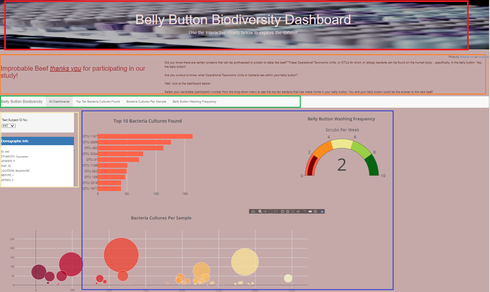

# _The Answer Lies Within…Your Belly Button_ || Belly Button Biodiversity Analysis

## Overview of Project

Improbable Beef, a food start-up is search of the next _beef_ ! With the help of a biological researcher, from a prominent microbiology laboratory, has found that very protein needed to create this new beef alternative lies in the bacteria found in the human belly button. 

To jump start this quest, belly button bacteria cultures were collected by volunteers and classified by Operational Taxonomic Units, or OTUs specifying bacteria type. The study included donations from both male and female participants of varied geographic residencies, ethnicities, and age. It was determined that at least 10 types of bacteria that “reside” in the human belly button would be a perfect match to synthesize beef or beef life protein. 

Post collection trial, findings were presented through a constructed dashboard, where volunteers can view the most common OTUs uncovered in their respective belly button, by selecting their participant/candidate number from a dropdown menu. More details on the Belly Button Biodiversity Dashboard, [below.](https://github.com/SoWhitIs/belly-button-biodiversity-analysis#belly-button-biodiversity-dashboard)

Improbable Beef also has access to these results and will potentially follow up with said candidate(s)that are suitable match. 

## Resources
* Data Source(s): [samples.json](https://github.com/SoWhitIs/belly-button-biodiversity-analysis/blob/35fba3d2b456ff1c57c80007996ae01e93b8c165/samples.json)

* Software/Tools(s):  Visual Studio Code, 1.54.1 |Languages(s): JavaScript, HTML, CSS| JavaScript Libraries: Plotly.js | JSON | Command-Line Interface: Git Bash |Bootstrap

## Belly Button Biodiversity Dashboard

The [Belly Button Biodiversity Dashboard](https://sowhitis.github.io/belly-button-biodiversity-analysis/) consist of three bright, colorful charts: “Top 10 Bacteria Cultures Found”, “Belly Button Washing Frequency”, “Bacteria Cultures Per Sample”. 

  <i><b> Belly Button Biodiversity Dashboard, Snapshot  </b></i> 
 

  

**User Experience**

* Red Box: Volunteers (or users) are welcomed with dashboard title and background image set to a soft colored paletted page. 

* Yellow Box: Users can select their number from the drop down menu and an individualized snapshot of what bacteria was found from their donations will be presented. 

* Orange Box: Just above the navigation bar a brief description of the project and a “thank you” to participants. 

* Green Box: Each chart can be accessed individually from the navigation menu just below the introductory title jumbotron. 

    * To reset the dashboard, user can simply click “All Dashboards” or refresh the page. 

* Purple/Blueish Box: View of Chats After volunter has selected _their_ number. 

 Experience the [dashboard!](https://sowhitis.github.io/belly-button-biodiversity-analysis/)

#### Author
_Whitney D. Gardner_
